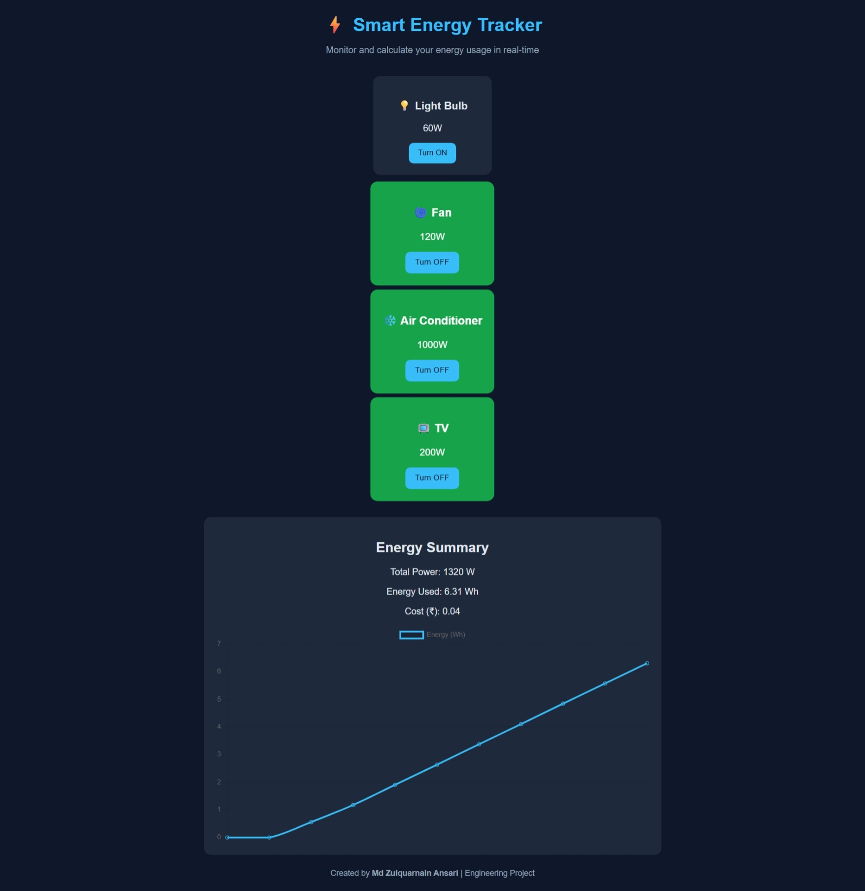

# Energy-tracker
# ⚡ Smart Energy Tracker

A simple, interactive web app built using **HTML, CSS, and JavaScript** that simulates real-time monitoring of household energy usage.  
You can toggle different appliances ON/OFF and instantly see total power, energy consumed, and estimated cost — complete with a live chart powered by **Chart.js**.

---

## 🧠 Features
- 🟢 Toggle devices ON/OFF (Light, Fan, AC, TV)
- ⚙️ Real-time total power calculation (Watts)
- 🔋 Energy consumption tracking (Wh)
- 💰 Automatic cost estimation (₹ per kWh)
- 📊 Live energy usage chart using Chart.js
- 🌙 Modern responsive design

---

## 🧩 Tech Stack
| Technology | Purpose |
|-------------|----------|
| **HTML5** | Structure and layout |
| **CSS3** | Styling and responsive UI |
| **JavaScript (ES6)** | Logic and interactivity |
| **Chart.js** | Dynamic data visualization |

---

## 🧰 Project Structure

---

## ⚙️ How It Works
1. Each device has a predefined power rating (in Watts).  
2. When you toggle it ON, its wattage adds to the total load.  
3. Every 2 seconds, the script calculates energy used = `Power × Time`.  
4. Cost is estimated using ₹7 per kWh.  
5. Chart.js updates live to show total energy trend.

---

## 📸 Preview

---

## 🧠 Future Improvements
- 🌞 Add dark/light mode toggle  
- 💾 Store data in localStorage to persist after refresh  
- 🧮 Add customizable tariff rate  
- 📅 Track daily or weekly consumption stats  

---

## 👨‍💻 Author
**Md Zulquarnain Ansari**  
🎓 Electrical Engineering Student  
💻 Passionate about embedded systems, IoT, and energy tech  
🔗 [LinkedIn](https://www.linkedin.com/in/md-zulquarnain-ansari-835a31269) | [GitHub](https://github.com/mdzulquar102-netizen)

---

### ⭐ Don’t forget to star this repo if you like it!
